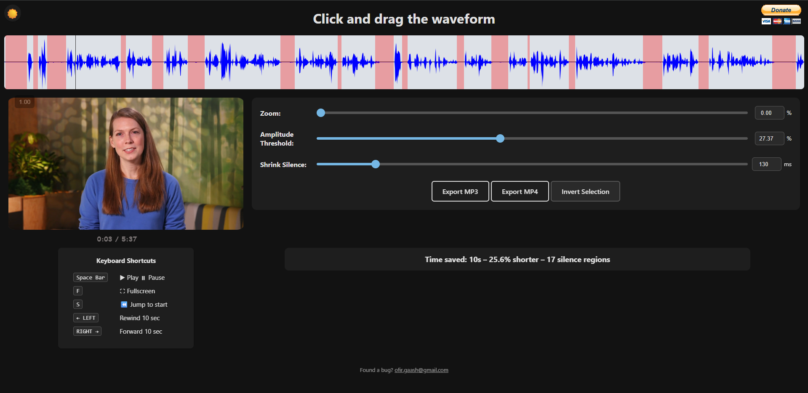

# Silence Remover

Live site: [https://silence-remover.com](https://silence-remover.com)
Manual GitHub Pages preview: run `.github/workflows/deploy-pages.yml` from Actions when needed.



## Purpose

Silence Remover is a browser-based editor for trimming silent sections from audio and video files.
It is designed to be fast and simple: upload a file, detect or adjust silence regions, and export a shorter result as MP3 or MP4.

## Desktop Releases

- Tagging `v*` triggers `.github/workflows/desktop-installers.yml` and publishes Windows and macOS installers.
- macOS releases are expected to be signed with a `Developer ID Application` certificate and notarized with App Store Connect.
- The workflow now fails if the required macOS signing or notarization secrets are missing, or if the built `.app` / `.dmg` fails validation.
- Use `npm run dist:mac:unsigned --prefix silence-cutter-desktop` only for local test builds. Do not ship that DMG to users.

## macOS Release Secrets

- `CSC_LINK`: base64-encoded exported `Developer ID Application` `.p12` certificate.
- `CSC_KEY_PASSWORD`: password for that `.p12`.
- `APPLE_API_KEY_P8`: contents of the App Store Connect API key file.
- `APPLE_API_KEY_ID`: the App Store Connect key ID.
- `APPLE_API_ISSUER`: the App Store Connect issuer UUID.

PowerShell example for `CSC_LINK` from a local `.p12`:

```powershell
[Convert]::ToBase64String([IO.File]::ReadAllBytes("C:\path\DeveloperIDApplication.p12"))
```

## Production Runbook

## Deployment path

- Production deploys run through GitHub Actions on the self-hosted `ec2` runner.
- The source of truth is `.github/workflows/deploy.yml`.
- The production stack is defined in `docker-compose.prod.yml`.

## Normal deploy

- Push to the `com` branch, or run the workflow manually from GitHub Actions.
- The workflow builds the image, recreates `web` and `certbot`, sets restart policies, and reinstalls the renewal cron job.
- `web` and `certbot` must both be running. Deploying only `web` can leave certificate renewal broken.

## SSL layout

- `docker-compose.prod.yml` shares the named `certbot-etc` volume between `web` and `certbot`.
- nginx reads the live certificate from `/etc/letsencrypt/live/silence-remover.com/`.
- The nginx config is baked into the image from `app/nginx.conf`, not from a host-specific bind mount.

## Renewal

- `renew-ssl.sh` renews certificates with certbot, then reloads nginx.
- `install-renew-cron.sh` installs the renewal cron job idempotently.
- The expected cron entry is:
  `17 2,14 * * * cd /home/ubuntu/silence-remover && bash /home/ubuntu/silence-remover/renew-ssl.sh >> /home/ubuntu/silence-remover/renew-ssl.log 2>&1`

## New machine or rebuilt machine

- Install Docker and Docker Compose on the target machine.
- Set up the self-hosted GitHub Actions runner.
- Point DNS for `silence-remover.com` and `www.silence-remover.com` to the new machine.
- Open inbound port `80` and `443`.
- Run the initial certificate bootstrap:
  `LETSENCRYPT_EMAIL=ops@example.com bash ./bootstrap-ssl.sh`
- After bootstrap succeeds, normal GitHub Actions deploys are enough.

## If the certificate expired

- Symptom: the browser shows `net::ERR_CERT_DATE_INVALID`.
- SSH to the server and run:
  `cd /home/ubuntu/silence-remover && bash ./renew-ssl.sh`
- Verify certbot sees a valid certificate:
  `docker compose -f docker-compose.prod.yml run --rm --entrypoint certbot certbot certificates`
- Verify the site serves the renewed certificate:
  `curl -Iv https://silence-remover.com`
- If renewal succeeds but the site still serves an old cert, reload or restart the web container:
  `docker exec silence-remover nginx -s reload || docker restart silence-remover`

## First checks during an outage

- `docker ps`
- `crontab -l`
- `docker compose -f docker-compose.prod.yml run --rm --entrypoint certbot certbot certificates`
- `curl -Iv https://silence-remover.com`
